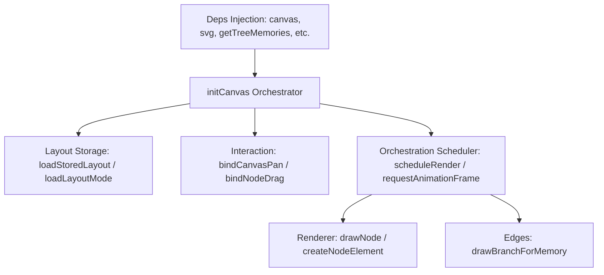

# editor-canvas.js Preflight Audit

This document details the preflight analysis and architectural decomposition plan for `js/editor/editor-canvas.js` under **Issue #1505**.

---

## 1. File Responsibility Classification

`editor-canvas.js` is the central controller of the editor canvas interface, managing visual rendering, pointer interactions, and persistence. Its contents are classified into six responsibility domains:

| Domain | Methods / Blocks | Risk Level | Description |
|:---|:---|:---|:---|
| **State / Storage** | `loadStoredLayout`, `loadLayoutMode`, `persistLayoutMode`, `persistStoredPositions` | **Low** | Loading and persisting coordinates, scales, and layout modes to/from `localStorage` |
| **Renderer** | `createNodeElement`, `attachNodeInfo`, `drawNode`, `drawBranchForMemory` (delegated) | **Medium** | Constructing node DOM trees, avatars, title lines, and drawing branch connection SVG paths |
| **Interaction** | `bindNodeDrag`, `bindCanvasPan`, hover affordance timers, dragging pointers tracking | **High** | Pointer events registration, dragging calculations, delta coordinates projection, boundaries |
| **API / Data** | `getWorldPosition`, `calcPosition` | **Low** | Coordinates adapters mapping between canvas world grid and screen coordinates |
| **Orchestrator** | `createEditorCanvas` constructor, `initCanvas`, `scheduleRender`, late-load/DOM ready triggers | **High** | Initialization lifecycle, dependencies resolution, rendering loops scheduler |
| **Mixed-Risk** | `switchToFreeMode`, `switchToStructuredMode`, `setLayoutMode`, `toggleLayoutMode`, `updateLayoutToggleUI` | **Medium** | Toggling layout states, triggering redraws, and applying CSS layout mode classes to DOM |

---

## 2. Major Functional Areas Mapping

The main functional sections of `editor-canvas.js` are mapped as follows:

- **Canvas DOM Root Lookup**: Matches queries on `#canvasArea` and `#canvasContainer`.
- **Node & Text Card Rendering**: Dynamically creates cards, adds thumbnails, titles, and formats dates.
- **Node Drag/Drop Pointer Handling**: Track delta movements relative to scale and offsets.
- **Viewport Helpers Integration**: Adapts scales and offsets from `LoveBudEditorCanvasViewport`.

---

## 3. Public Contracts & Namespaces

`editor-canvas.js` establishes the following global interfaces:

- `window.createEditorCanvas(deps)`: Bootstrapper returning the canvas API instance.
- `window.LoveBudEditorCanvas.initCanvas()`: Singleton trigger for canvas rendering updates.
- `window.LoveBudEditor`: Common bridge exposing refresh hooks for legacy code compatibility.
- **DOM Dependencies**: Binds directly to elements `#canvasArea`, `#canvasContainer`, `.layout-toggle`, `.canvas-empty-guide`.
- **Script Dependency Order**: Loaded after basic geometry, layout, node, viewport, and viewport helper scripts, and before edges/toolbar modules.

---

## 4. Browser Smoke Checklist

Verification of changes to the canvas controller requires confirming the following behaviors:

- **Editor Load Gate**: Canvas area initializes without console errors when entering the editor page.
- **Empty State**: Displays `.canvas-empty-guide` when `getTreeMemories()` returns an empty array.
- **Single Node State**: Centralizes and renders a single root node on canvas.
- **Multi-Node Tree State**: Renders nodes and connects them with SVG branch lines.
- **Card Selection**: Clicking a memory node highlights the node border and updates the sidebar details panel.
- **Drag Interaction**: Dragging a node in "free mode" updates its position and redraws branches smoothly.
- **Layout Toggling**: Switching between "free" and "structured" modes updates indicator texts and classes.

---

## 5. Next Narrow Slice Candidates (1~3)

To safely reduce `editor-canvas.js` size, the following narrow implementation slices are proposed:

### Candidate 1: Delegate Remaining Storage Fallbacks
- **Target Responsibility**: State / Storage (localStorage loading and mode serialization).
- **Target File**: [editor-canvas-layout-storage.js](file:///mnt/g/Ddrive/BatangD/task/workdiary/LoveBud/js/editor/editor-canvas-layout-storage.js) (MODIFY)
- **Goal**: Move local inline fallback blocks for layout mode and stored positions from `editor-canvas.js` into the existing storage helper module, maintaining a delegation wrapper.
- **Contract Tests**: Verify fallback logic when storage helper namespace is missing.
- **Risk Level**: **Low**

### Candidate 2: Extract Viewport Layout Fit Handler
- **Target Responsibility**: Orchestration / Viewport (centralizing, resizing, selection centering).
- **Target File**: `js/editor/editor-canvas-viewport-fit-handler.js` (NEW)
- **Goal**: Move functions `fitViewportToTree`, `keepSelectionVisible`, and `bindResizeHandling` to a dedicated integration helper.
- **Contract Tests**: Verify fit logic calculations and resize debounce timer registration.
- **Risk Level**: **Medium**

### Candidate 3: Extract Layout Mode Transition Manager
- **Target Responsibility**: Mixed-Risk (handling free/structured mode switching animations and classes).
- **Target File**: `js/editor/editor-canvas-layout-transition.js` (NEW)
- **Goal**: Move `switchToFreeMode`, `switchToStructuredMode`, `setLayoutMode`, and layout mode toggle event listeners into a transition helper.
- **Contract Tests**: Verify layout classes toggle and mode strings clamping.
- **Risk Level**: **Medium**
