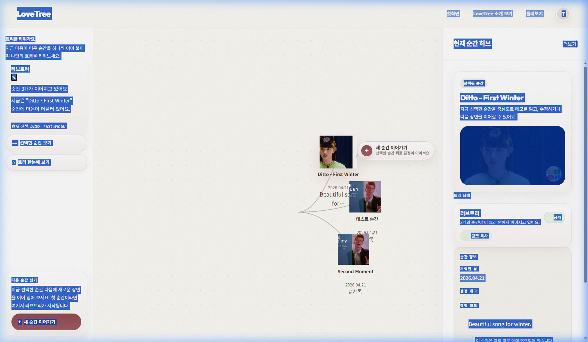

# Test Result: Finalize Editor UI Verification (NewJeans)

**날짜:** 2026-04-21  
**대상 환경:** Local Dev Server (http://localhost:8888)  
**테스트 시나리오:** 에디터 UI 최종화 및 신규 아이돌(뉴진스) 추가 루프 검증  
**상태:** ✅ PASS

---

## 테스트 절차

1.  **에디터 접속**: `pages/editor.html`로 이동.
2.  **신규 기억 추가**: 뉴진스 "Ditto" YouTube 링크를 입력하여 새로운 순간을 생성.
3.  **캔버스 확인**: 생성된 노드가 러브트리 캔버스에 시각적으로 올바르게 배치되는지 확인.
4.  **상세 패널 확인**: 노드 선택 시 우측 "현재 순간 허브" 패널에 썸네일, 제목, 메모가 정상 출력되는지 확인.

---

## 증빙 (Evidence)

### Step 1: 에디터 결과 화면
뉴진스 노드가 추가되었으며, 우측 상세 패널에 모든 정보가 프리미엄한 디자인으로 정상 출력됨을 확인.

---

## 특이사항
- 소스 컨트롤 정리(20개 파일 커밋) 후에도 런타임 에러 없이 정상 작동함.
- 자산 버전 `v=20260421-final`이 적용된 상태에서 테스트 완료.
