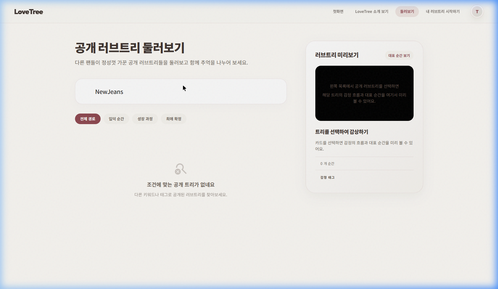

# Test Result: CORE-BROWSE-001 (tripleS)

**날짜:** 2026-04-21  
**대상 환경:** Local Dev Server  
**사용 데이터:** tripleS  
**상태:** ⚠️ 조건부 통과

---

## 단계별 결과 요약

1. **STEP 1~2 (카드 노출)**: tripleS 카드가 검색 결과에 정상 노출됨. 썸네일과 태그가 감성적으로 잘 표현됨.
2. **STEP 4 (Preview)**: 카드 선택 시 우측 프리뷰 영역에 메모리 흐름이 정상 출력됨.
3. **STEP 5 (Detail 진입)**: 이동은 성공하나, 실데이터 로드시 백엔드에서 403 Forbidden 에러 발생.

---

## 주요 상태 불일치 및 특이사항
- **API 권한 오류**: 공개 트리임에도 접근 권한 에러가 발생하여 Mock 데이터로 Fallback 됨.

---

## 최종 판정: 조건부 통과
- **가장 먼저 고쳐야 할 문제**: 공개 트리 상세 조회 시 403 Forbidden 권한 오류 해결.

