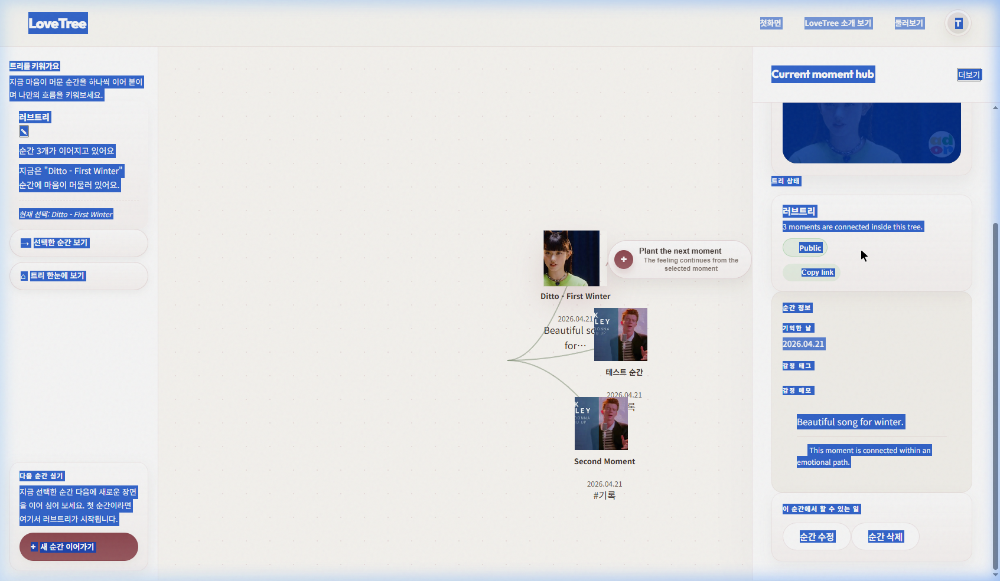

# Test Result: CORE-RETURNING-001 (tripleS)

**날짜:** 2026-04-21  
**대상 환경:** Local Dev Server  
**사용 데이터:** tripleS  
**상태:** ✅ 통과

---

## 단계별 결과 요약

1. **Step 1~4 (My Trees & Editor)**: 기존 트리 카드 및 캔버스 노드가 100% 일치하며 로드됨.
2. **Step 5~6 (편집 및 추가)**: 제목 수정 및 새 순간 추가 시 즉각적인 UI 반영 확인.
3. **Step 9 (재진입)**: 목록 이탈 후 재진입 시에도 수정 사항이 완벽히 유지됨.

---

## 주요 상태 불일치 및 특이사항
- 없음.

---

## 최종 판정: 통과
- **가장 먼저 고쳐야 할 문제**: 에디터 내에서 공개용 상세 페이지로 넘어가는 버튼의 통합 필요.

