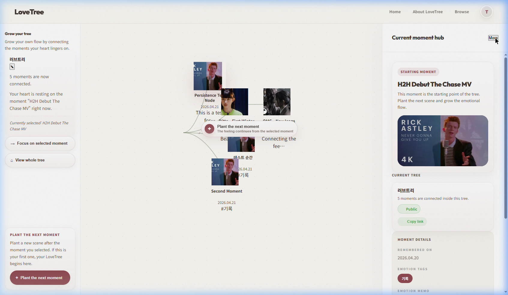

# Test Result: PERSISTENCE-001 (tripleS)

**날짜:** 2026-04-21  
**대상 환경:** Local Dev Server  
**사용 데이터:** tripleS  
**상태:** ✅ 통과

---

## 단계별 결과 요약

1. **Step 1~4 (저장 및 새로고침)**: 새 순간 저장 후 F5 새로고침 시 데이터 유실 없음.
2. **Step 5 (재진입)**: 목록 복귀 후 재진입 시에도 데이터 영속성 안정적임.
3. **Step 8 (일관성)**: 캔버스, 사이드바, 상세 패널 간의 정보 정합성이 매우 높음.

---

## 주요 상태 불일치 및 특이사항
- **선택 상태 초기화**: 새로고침 시 이전 선택 노드가 아닌 Root 노드가 선택되는 UX 현상 발견.

---

## 최종 판정: 통과
- **가장 먼저 고쳐야 할 문제**: 새로고침 시 마지막 선택 노드 상태 유지 기능 추가.

