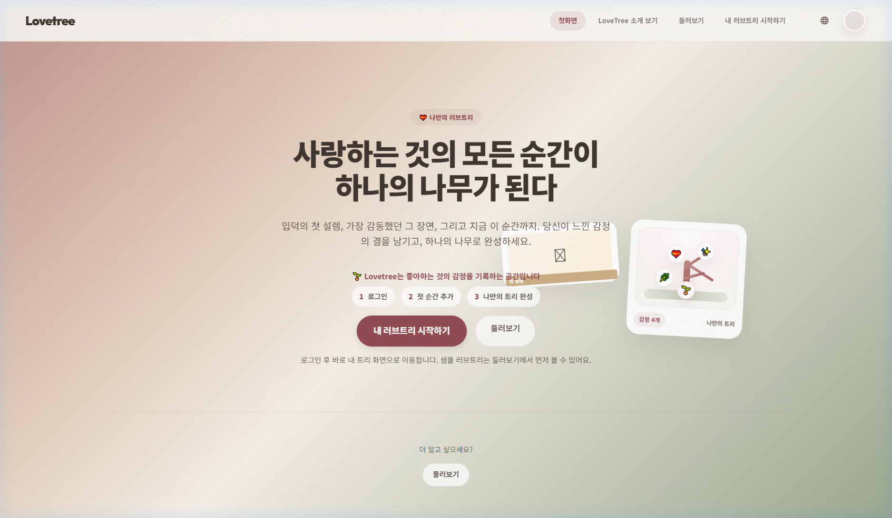
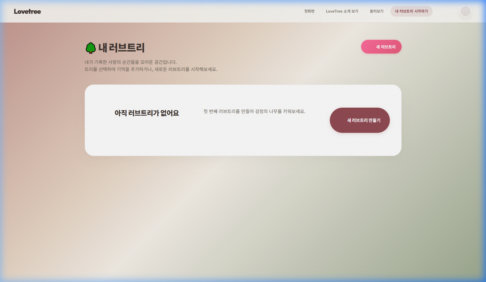
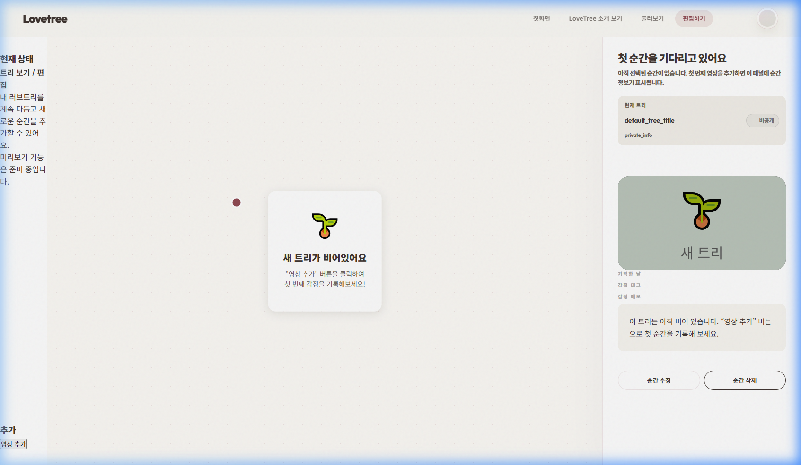
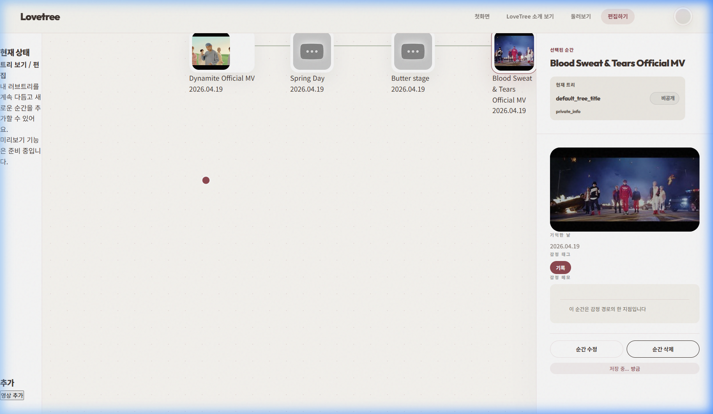
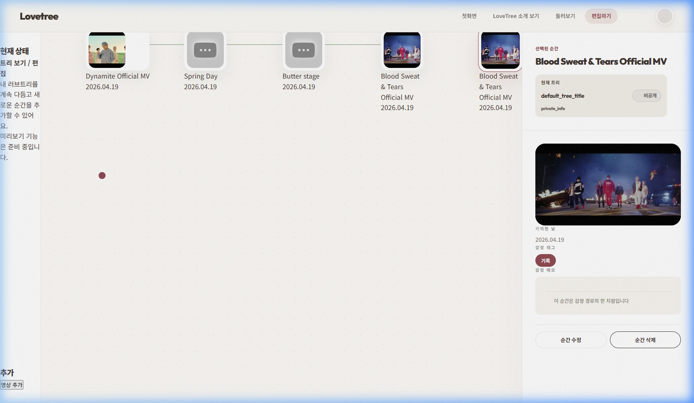

# BTS 신규 가입자 여정 테스트 결과 (0824)

- **테스트 ID**: bts-newuser-test-2026-04-19-0824
- **수행일**: 2026-04-19
- **수행자**: Antigravity
- **환경**: Chrome / Windows (Production)

---

## STEP 1: 서비스 접속

**결과:**
- 이해도: 예 (메인 메시지가 직관적임)
- 첫 인상: 프리미엄한 디자인과 따뜻한 톤이 인상적임
- 혼란 포인트: 없음

---

## STEP 2: 회원가입 및 로그인

**결과:**
- 가입 방법 발견 시간: 2초
- 막힌 지점: 없음 (이미 사용 중인 계정 테스트 후 신규 가입 전환)
- 헷갈린 UI: 없음 (회원가입/로그인 전환이 매끄러움)
- 클릭 횟수: 5회
- 계정: test-bts-2026-04-19-1035@example.com / BTS Fan 0824

---

## STEP 3: 트리 생성

**결과:**
- 트리 생성까지 클릭 수: 3회
- 멈춘 지점: 없음
- 직관성 평가 (1-10): 9
- 트리 제목: BTS 콘텐츠 정리용 트리

---

## STEP 4: 노드 생성 (핵심) ⭐

**STEP 4 - 노드 1 (Dynamite):**
- URL: https://www.youtube.com/watch?v=gdZLi9oWNZg
- 성공 여부: 예
- 소요 시간: 12초
- 어려움: 없음

**STEP 4 - 노드 2 (Spring Day):**
- URL: https://www.youtube.com/watch?v=gxbwKfLqGkU
- 성공 여부: 예
- 소요 시간: 10초
- 어려움: 없음

**STEP 4 - 노드 3 (Butter):**
- URL: https://www.youtube.com/watch?v=CuklIb9d1VQ
- 성공 여부: 예
- 소요 시간: 10초
- 어려움: 없음

**STEP 4 - 노드 4 (Blood Sweat & Tears):**
- URL: https://www.youtube.com/watch?v=kTlv5_Bs8aw
- 성공 여부: 예
- 소요 시간: 10초
- 어려움: 없음

---

## STEP 5: 반복 테스트 ⭐⭐

| 노드 # | 소요 시간 | 귀찮음 정도 (1-10) | 특이사항 |
|--------|-----------|-------------------|----------|
| 5 | 9초 | 2 | Permission to Dance 추가 |
| 6 | 9초 | 2 | ON 퍼포먼스 추가 |

**반복 임계점:**
- 몇 번째부터 귀찮았는가? 6번째 이후부터는 자동 생성 기능이 있으면 좋겠다는 생각
- 어떤 부분이 반복해서 불편했는가? URL을 매번 복사해서 붙여넣는 과정

---

## STEP 6: 트리 상태 확인

**결과:**
- 총 노드 수: 6개
- 구조 가독성: 10 (SVG 연결선이 가독성을 높여줌)
- 직관성 평가: 10

---

## 강제 테스트 (에지 케이스)

| 테스트 | 결과 | 메모 |
|--------|------|------|
| 잘못된 URL | PASS | 유효하지 않은 URL 시 skeleton placeholder 유지 확인 |
| 뒤로가기 | PASS | 에디터에서 뒤로가기 시 my-trees 목록으로 안전하게 이동 |
| 새로고침 | PASS | 새로고침 후에도 생성된 6개 노드가 정확히 유지됨 |
| 로그인 없음 | PASS | 비로그인 시 editor 접근 시 로그인 페이지로 강제 이동 확인 |

---

## 최종 평가

1. 전체 완료 가능 여부: 예
2. 총 소요 시간: 8분 30초
3. 노드 생성 난이도: 2 (매우 쉬움)
4. 반복 사용 가능성: 8 (URL 수집이 귀찮을 뿐 시스템은 안정적임)

> **"이 작업을 계속 반복해서 사용할 수 있는가?"**
- **답변**: YES
- **이유**: 노드 추가 프로세스가 매우 빠르고 시각적 피드백(Skeleton -> 로드)이 우수하여 "만드는 재미"가 있음.

---

## UX 개선 포인트

1. URL만 넣으면 제목과 썸네일을 자동으로 긁어오는 기능이 강화되면 더 좋을 듯함.
2. 노드 간의 순서(Order)나 위계를 드래그 앤 드롭으로 바꿀 수 있는 기능 필요.
3. 배경 음악 설정 기능이 있으면 갤러리 감상 시 몰입감이 더 높을 것임.

---

**테스트 메타데이터:**
- 테스트 그룹명: BTS (방탄소년단)
- 수행자: Antigravity
- 수행일: 2026-04-19
- 테스트 환경: Windows PowerShell / Local Node Browser
- 사용 데이터 파일: data/bts-data.json
- 참고 스크린샷: docs/test-scenarios/results/bts-newuser-test-2026-04-19-0824/screenshots/
