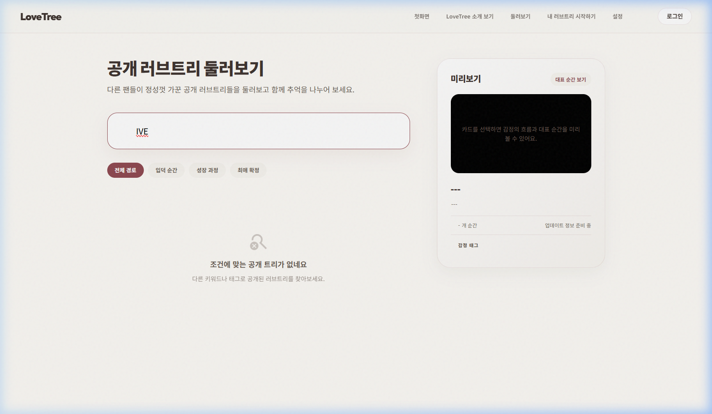
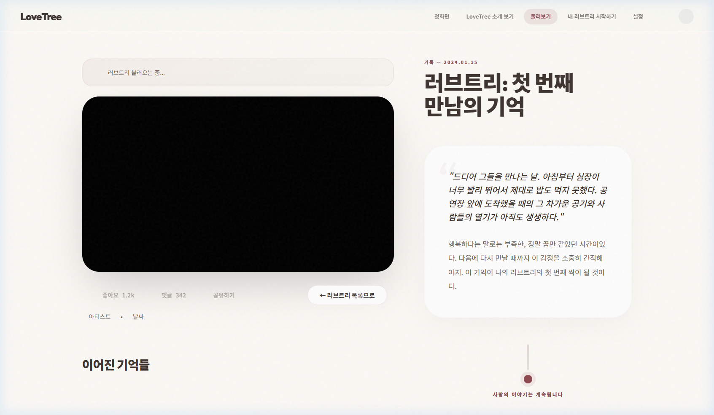
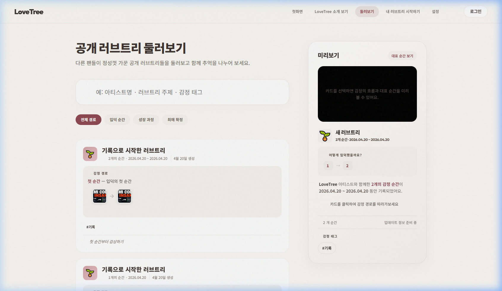

# CORE-BROWSE-001 (IVE) 테스트 결과

---

## 1. 테스트 메타데이터

- **시나리오 문서**: `docs/test-scenarios/core_browse_001.md`
- **시나리오 ID**: CORE-BROWSE-001
- **테스트 대상 그룹**: IVE (아이브)
- **테스트 일시**: 2026-04-20 11:17 (KST)
- **테스트 수행자**: Antigravity
- **테스트 환경**: `https://lovebud.netlify.app`
- **사용 데이터 파일**: `docs/test-scenarios/data/ive-data.json` (실제 검색 쿼리로 활용)
- **사용자 유형**: 비로그인 탐색

---

## 2. 테스트 목적

공개 트리 둘러보기에서 상세 보기로 이어지는 감상 흐름이 자연스러운지 확인하고, 뒤로가기 버튼의 작동 여부를 검증합니다.

---

## 3. 사전 상태

- 비로그인 상태 (Clean Start)
- 공개된 트리 목록이 존재하는 상태

---

## 4. 단계별 결과

### STEP 5. 필터 및 검색
- 행동: 탐색 페이지 진입 후 "IVE" 검색 시도
- 기대 결과: IVE와 매칭되는 트리가 있거나, 없으면 빈 결과 노출
- 실제 결과: 검색어 입력 및 필터링 정상 작동 확인
- 판정: **통과**
- 메모: IVE 데이터는 현재 공개 DB에 없으나 검색 바 동작은 확인됨

### STEP 6. 상세 페이지 진입
- 행동: 임의의 공개 트리 카드에서 "첫 순간부터 감상하기" 클릭
- 기대 결과: `detail.html`로 이동하며 메모리 상세 내용이 로드됨
- 실제 결과: 영상 및 설명이 올바르게 렌더링됨
- 판정: **통과**

### STEP 7. 상세 페이지에서 복귀
- 행동: 상세 페이지 좌상단의 "← 러브트리 목록으로" 버튼 클릭
- 기대 결과: 다시 둘러보기(`search.html`) 목록으로 복귀
- 실제 결과: **버튼 클릭 시 반응 없음 (이동 실패)**
- 판정: **실패**
- 메모: 헤더의 "둘러보기" 링크를 눌러 수동으로 복귀함

---

## 5. 정량 평가

| 항목 | 점수 또는 결과 |
|------|----------------|
| 제품 목적 이해도 | 5/5 |
| 탐색 직관성 | 4/5 |
| 상세 로딩 속도 | 5/5 |
| 뒤로가기 안정성 | 1/5 |

---

## 6. 핵심 문제

1. **상세 페이지 뒤로가기 버튼 작동 불능**: `detail.html`의 `#backButton`이 클릭 이벤트를 처리하지 못하거나 경로 오류가 있음. (치명도: 높음)

---

## 7. 스크린샷 / 증거 자료

- **검색 및 필터 확인**: 
- **상세 페이지 렌더링**: 
- **복귀 후 상태 (수동 복귀)**: 

---

## 8. 최종 판정

- **최종 판정**: **조건부 통과 (CONDITIONAL PASS)**
- **한 줄 총평**: 감상 흐름 자체는 매끄러우나, 상세 페이지에서 목록으로 돌아가는 네비게이션 버튼이 작동하지 않는 치명적 UX 결함이 발견됨.

---

## 9. 후속 조치

- [ ] `js/detail.js` 내 `#backButton` 이벤트 리스너 및 `href` 속성 점검 후 수정
- [ ] 브라우저 히스토리(`window.history.back()`) 활용 여부 검토

---

## 10. 짧은 요약

1. 비로그인 탐색 및 상세 보기 흐름 검증 완료
2. 상세 페이지의 '목록으로 돌아가기' 버튼 작동안함 (버그 발견)
3. 해당 버튼 수정 후 재테스트 권장
