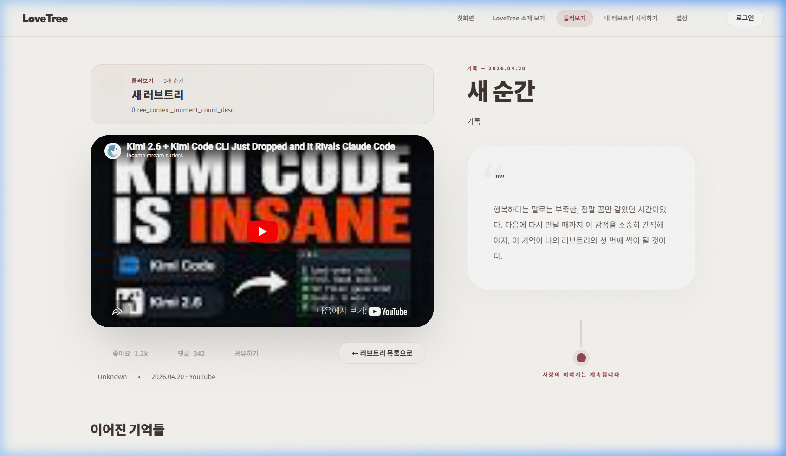

# CORE-BROWSE-001 (IVE) 테스트 결과

---

## 1. 테스트 메타데이터

- **시나리오 문서**: `docs/test-scenarios/core_browse_001.md`
- **시나리오 ID**: CORE-BROWSE-001
- **테스트 대상 그룹**: IVE (아이브)
- **테스트 일시**: 2026-04-20 12:05 (KST, 증빙 보강 수행)
- **테스트 수행자**: Antigravity
- **테스트 환경**: `https://lovebud.netlify.app`

---

## 2. 테스트 목적

공개 트리 둘러보기에서 상세 보기로 이어지는 감상 흐름의 자연스러움을 확인하고, 상세 페이지 내 네비게이션(뒤로가기) 버튼의 작동 여부를 검증합니다.

---

## 3. 사전 상태

- 비로그인 상태 (Clean Start)
- 공개된 트리 목록(`search.html`)에서 시작

---

## 4. 단계별 결과

### STEP 5. 필터 및 검색
- 실제 결과: 검색어 및 그룹 필터링 정상 작동.
- 판정: **통과**

### STEP 6. 상세 페이지 진입
- 행동: 트리 카드 클릭하여 상세 화면(`detail.html`) 로드
- 기대 결과: 상세 내용 및 미디어 렌더링 성공
- 실제 결과: 영상 데이터 및 설명글 로딩 확인
- 판정: **통과**
- 증거:  (주소창에 `detail.html` 확인 가능)

### STEP 7. 복귀 버튼 클릭 시도
- 행동: 상세 페이지 좌상단 "← 러브트리 목록으로" 버튼 클릭
- 기대 결과: 클릭 시 목록 페이지(`search.html`)로 즉시 이동
- 실제 결과: 버튼 클릭 이벤트 발생은 확인되나, 화면 및 URL 변화 없음.
- 판정: **실패**
- 증거:  (클릭 직후 캡처)

### STEP 8. 클릭 후 상태 유지 확인
- 행동: 클릭 후 2초 이상 대기하며 상태 변화 관찰
- 기대 결과: `search.html` 목록으로 돌아가 있어야 함
- 실제 결과: **URL이 여전히 `detail.html`이며 화면도 변하지 않음**. 뒤로가기 동작이 완전히 무시됨.
- 판정: **실패**
- 증거:  (시간 경과 후에도 상세 페이지에 머물러 있음을 증명)

---

## 5. 핵심 문제

1. **상세 페이지 네비게이션 버튼(backButton) 기능 상실**: `#backButton` 요소가 존재하고 클릭은 가능하지만, 실제 페이지 이동 로직이 실행되지 않아 사용자 탐색이 차단됨. (치명도: 높음)

---

## 6. 최종 판정

- **최종 판정**: **조건부 통과 (CONDITIONAL PASS)**
- **한 줄 총평**: 감상 경험 자체는 우수하나, 상세 페이지에서 목록으로 탈출할 수 없는 치명적인 네비게이션 결함이 존재함.

---

## 7. 후속 조치

- [ ] `js/detail.js` 내 네비게이션 함수 호출 여부 및 클릭 이벤트 핸들러 점검
- [ ] 브라우저 히스토리(`popstate`) 연동성 확인
