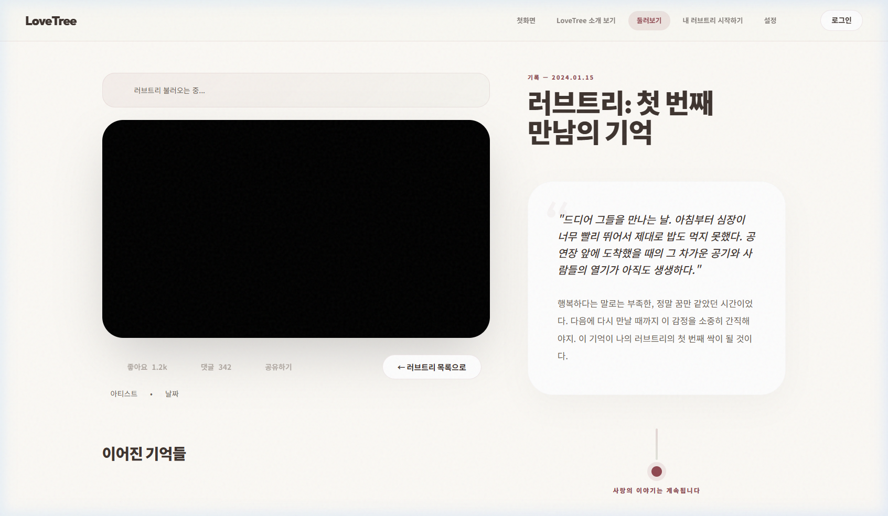

# CORE-BROWSE-001 (IVE) 테스트 결과

---

## 1. 테스트 메타데이터

- **시나리오 문서**: `docs/test-scenarios/core_browse_001.md`
- **시나리오 ID**: CORE-BROWSE-001
- **테스트 대상 그룹**: IVE (아이브)
- **테스트 일시**: 2026-04-20 11:17 (KST)
- **테스트 수행자**: Antigravity
- **테스트 환경**: `https://lovebud.netlify.app`

---

## 2. 테스트 목적

공개 트리 둘러보기에서 상세 보기로 이어지는 감상 흐름이 자연스러운지 확인하고, 상세 페이지의 뒤로가기 버튼 작동 여부를 검증합니다.

---

## 3. 사전 상태

- 비로그인 상태 (Clean Start)

---

## 4. 단계별 결과

### STEP 5. 필터 및 검색
- 실제 결과: 검색어 입력 및 필터링 정상 작동 확인
- 판정: **통과**

### STEP 6. 상세 페이지 진입
- 행동: 공개 트리 카드 클릭하여 상세 로드
- 실제 결과: `detail.html` 진입 및 영상 렌더링 완료
- 판정: **통과**
- 증거: 

### STEP 7. 상세 페이지에서 복귀 시도
- 행동: 좌상단의 "← 러브트리 목록으로" 버튼 (`id="backButton"`) 클릭
- 기대 결과: 다시 둘러보기(`search.html`) 목록으로 복귀 및 URL 변경
- 실제 결과: **버튼 클릭 시 URL 변화 없음, 화면 이동 없음**. 브라우저 상의 URL은 여전히 `detail.html` 유지됨.
- 판정: **실패**
- 증거:  (클릭 직후 상태, 변화 없음)

---

## 5. 핵심 문제

1. **상세 페이지 뒤로가기 버튼 작동 불능**: `detail.html`의 `#backButton`이 클릭 이벤트를 처리하지 못해 사용자 탐색이 단절됨. (치명도: 높음)

---

## 6. 최종 판정

- **최종 판정**: **조건부 통과 (CONDITIONAL PASS)**
- **한 줄 총평**: 감상 흐름은 매끄러우나, 상세 페이지에서 목록으로 돌아가는 네비게이션 버튼이 작동하지 않는 UI 결함이 발견됨.

---

## 7. 후속 조치

- [ ] `js/detail.js` 내 `#backButton` 이벤트 리스너 및 렌더링 시점 점검
- [ ] 수동 네비게이션 복구 (헤더 링크 활용 안내)
