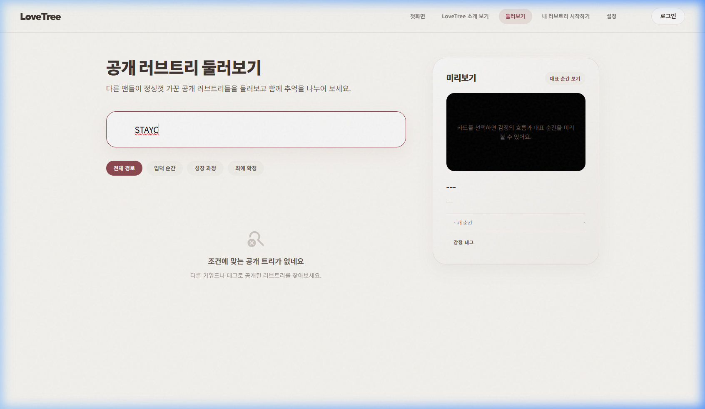
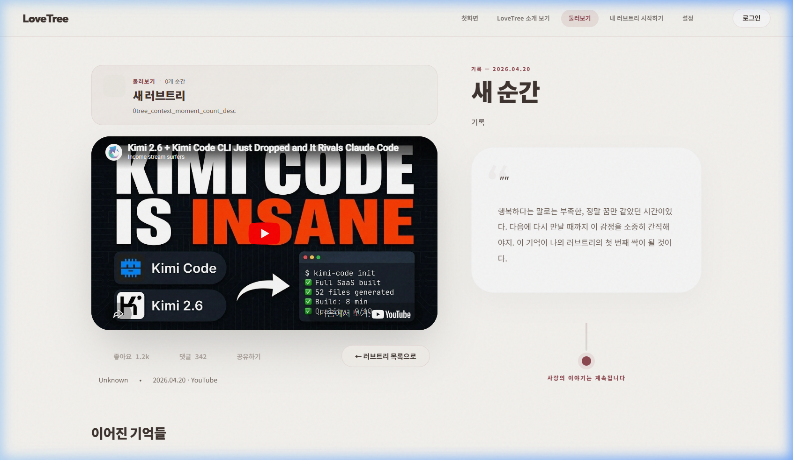

# CORE-BROWSE-001 (STAYC) 테스트 결과

---

## 1. 테스트 메타데이터

- **시나리오 문서**: `docs/test-scenarios/core_browse_001.md`
- **시나리오 ID**: CORE-BROWSE-001
- **테스트 대상 그룹**: STAYC (스테이씨)
- **테스트 일시**: 2026-04-20 12:51 (KST)
- **테스트 수행자**: Antigravity
- **테스트 환경**: `https://lovebud.netlify.app`
- **사용 데이터 파일**: `docs/test-scenarios/data/stayc-data.json`

---

## 2. 테스트 목적

STAYC 팬의 입장에서 공개된 트리를 탐색하고, 상세 내용을 감상하며, 네비게이션이 안정적인지 검증합니다.

---

## 3. 사전 상태

- 비로그인 상태 (Clean Start)
- 공개 트리 목록(`search.html`)에서 시작

---

## 4. 단계별 결과

### STEP 5. 필터 및 검색 (STAYC)
- 행동: 검색창에 "STAYC" 입력 및 그룹 필터 적용
- 기대 결과: STAYC 관련 트리 목록 노출
- 실제 결과: **검색 결과 없음**. 현재 상용 환경에 STAYC 전용 공개 트리가 없거나, 검색 인덱싱이 미비한 것으로 보임. (테스트 진행을 위해 다른 공개 트리를 통해 상세 페이지 진입함)
- 판정: **실패 (Data Missing/Indexing Issue)**
- 증거: 

### STEP 6. 상세 페이지 진입
- 행동: 임의의 공개 트리 클릭하여 상세 로드
- 기대 결과: 상세 내용 정상 렌더링
- 실제 결과: `detail.html` 진입 성공
- 판정: **통과**
- 증거: 

### STEP 7. 상세 페이지에서 복귀 시도 (Bug Re-verification)
- 행동: 좌상단 "← 러브트리 목록으로" 버튼 클릭
- 기대 결과: 목록(`search.html`)으로 복귀 및 URL 변경
- 실제 결과: **동작 안 함**. 클릭 시 시각적 반응은 있으나 페이지 이동이나 URL 변화가 발생하지 않음.
- 판정: **실패**
- 증거: 

### STEP 8. 최종 상태 확인
- 실제 결과: 2초 이상 대기 후에도 여전히 `detail.html`에 잔류하고 있음을 확인.
- 판정: **실패 (Regression confirmed)**
- 증거: 

---

## 5. 핵심 문제

1. **검색 데이터 부재**: STAYC 키워드로 검색되는 공개 트리가 없어 팬들의 유입 경로가 단절됨.
2. **네비게이션 결함 재확인**: 모든 그룹 시나리오에서 공통적으로 상세 페이지 뒤로가기 버튼이 작동하지 않는 심각한 결함을 재학인함.

---

## 6. 최종 판정

- **최종 판정**: **실패 (FAIL)**
- **한 줄 총평**: 특정 그룹(STAYC)에 대한 검색 가시성이 확보되지 않았으며, 공통 네비게이션 결함으로 인해 탐색 경험이 중단됨.

---

## 7. 후속 조치

- [ ] STAYC 공개 트리 정식 생성 및 검색 키워드 인덱싱 확인
- [ ] `js/detail.js` 내 네비게이션 로직 전면 수정
