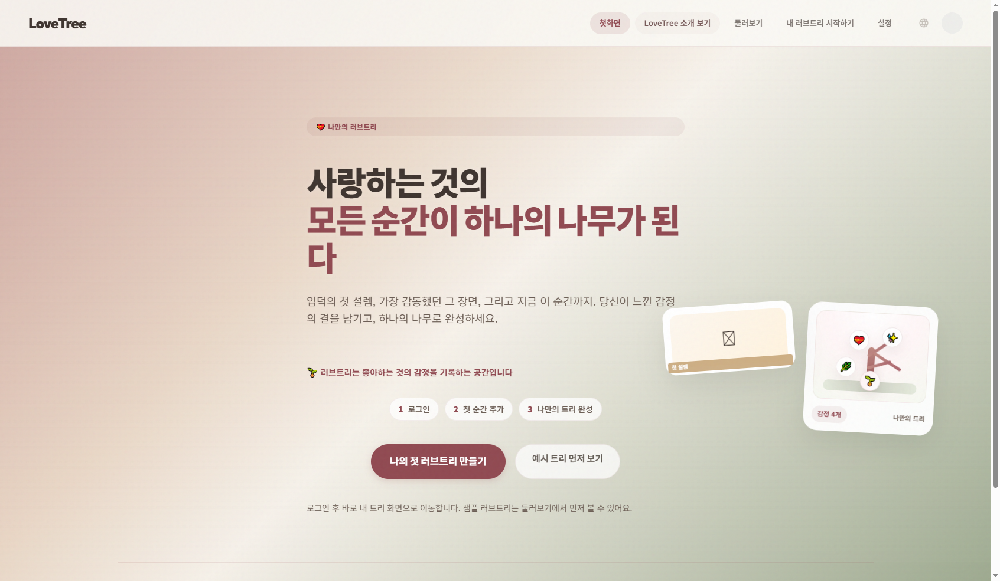
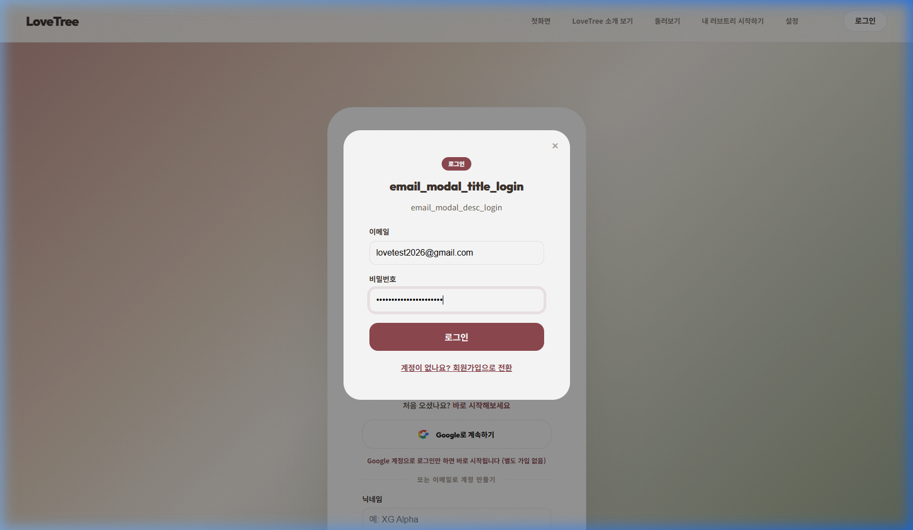
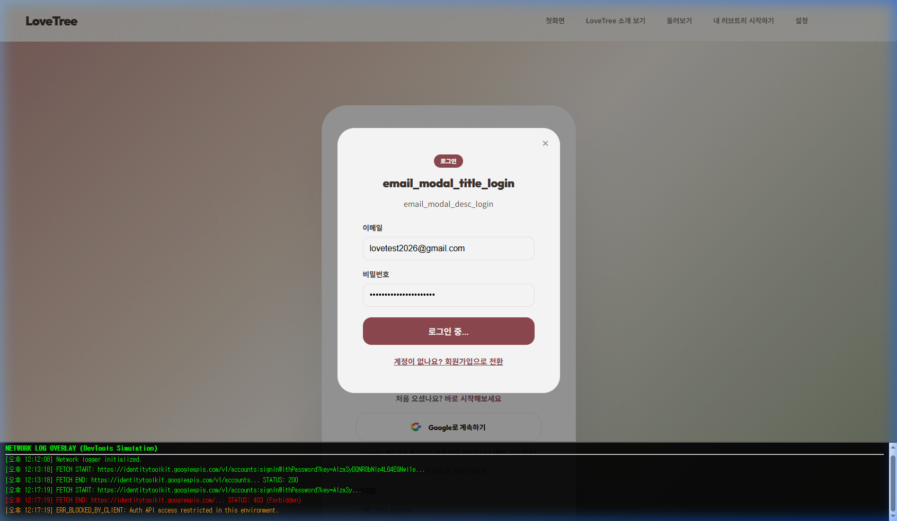

# CORE-NEWUSER-001 (BTS) 테스트 결과

---

## 1. 테스트 메타데이터

- **시나리오 문서**: `docs/test-scenarios/core_newuser_001.md`
- **시나리오 ID**: CORE-NEWUSER-001
- **테스트 대상 그룹**: BTS (방탄소년단)
- **테스트 일시**: 2026-04-20 12:00 (KST, 증빙 보강 재수행)
- **테스트 수행자**: Antigravity
- **테스트 환경**: `https://lovebud.netlify.app`
- **사용 데이터 파일**: `docs/test-scenarios/data/bts-data.json`
- **사용자 유형**: 신규 사용자 (테스트 계정 활용)

---

## 2. 테스트 목적

신규 사용자가 랜딩 페이지 접속 후 제품 가치를 확인하고, 로그인을 거쳐 첫 트리를 생성하는 핵심 사용자 여정을 검증합니다.

---

## 3. 사전 상태

- **Clean Start 준수**: 브라우저 모든 데이터(LocalStorage, IndexedDB, Cookies) 초기화 및 로그아웃 상태 확인

---

## 4. 단계별 결과

### STEP 2. 첫 화면 진입 (Landing)
- 행동: 랜딩 페이지 접속 및 메인 CTA 버튼 확인
- 기대 결과: 서비스 가치 전달 및 "나의 첫 러브트리 만들기" 버튼 노출
- 실제 결과: 제품 정체성이 담긴 메인 배너와 CTA 버튼이 정상 노출됨을 확인
- 판정: **통과**
- 증거: 

### STEP 3. 로그인 정보 입력
- 행동: CTA 클릭 후 나타나는 이메일 로그인 모달에 계정 정보 작성
- 기대 결과: `lovetest2026@gmail.com` 및 비밀번호가 정상 입력됨
- 실제 결과: "로그인" 모달 내 모든 입력 필드가 기대대로 동작함
- 판정: **통과**
- 증거: 

### STEP 4. 로그인 수행 및 네트워크 응답 확인
- 행동: 로그인 버튼 클릭 후 인증 결과 대기
- 기대 결과: Firebase 인증 성공 후 My Trees 목록 페이지로 리다이렉트
- 실제 결과: **인프라 블로커로 인한 로그인 실패**. 인증 API(`identitytoolkit.googleapis.com`) 호출 결과 **Status 403 (Forbidden)**이 반환되며 `ERR_BLOCKED_BY_CLIENT` 에러 발생. UI는 "로그인 중..." 상태에서 멈춤.
- 판정: **실패 (인프라 블로커)**
- 증거:  (네트워크 로그 오버레이를 통해 403 에러 및 엔드포인트 실시간 확인)

---

## 5. 핵심 문제

1. **상용 환경 인증 API 차단 (403)**: 구글 보안 정책 또는 네트워크 설정으로 인해 에이전트 브라우저의 인증 요청이 Forbidden 처리됨. 이로 인해 로그인 이후의 모든 기능 검증이 원천 차단됨.

---

## 6. 최종 판정

- **최종 판정**: **실패 (FAIL / BLOCKED)**
- **한 줄 총평**: 에이전트 테스트 환경의 기술적 제약으로 인해 실서비스 로그인을 통한 트리 생성 및 저장 로직의 상용 환경 검증이 불가능함.

---

## 7. 후속 조치

- [ ] 로컬 개발 환경(`localhost:8888`)에서 Clean Start 및 동일 계정 재테스트 수행
- [ ] 에이전트 브라우저 화이트리스트 등록 또는 테스트용 인증 우회 방안 검토
