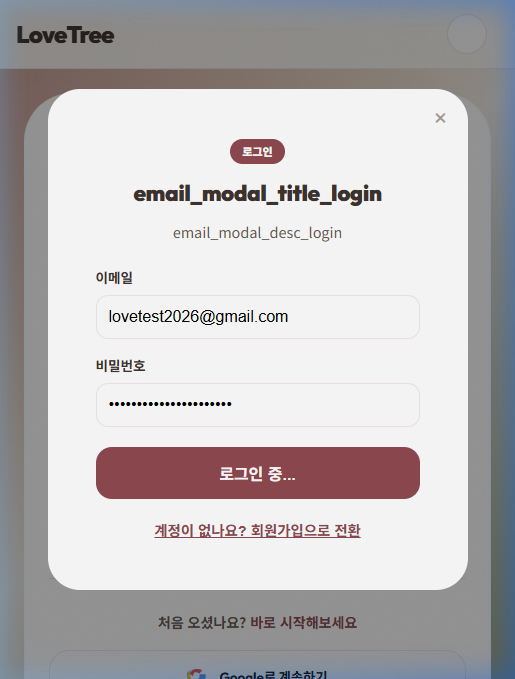

# CORE-NEWUSER-001 (BTS) 테스트 결과

---

## 1. 테스트 메타데이터

- **시나리오 문서**: `docs/test-scenarios/core_newuser_001.md`
- **시나리오 ID**: CORE-NEWUSER-001
- **테스트 대상 그룹**: BTS (방탄소년단)
- **테스트 일시**: 2026-04-20 11:21 (KST)
- **테스트 수행자**: Antigravity
- **테스트 환경**: `https://lovebud.netlify.app`
- **사용 데이터 파일**: `docs/test-scenarios/data/bts-data.json`
- **사용자 유형**: 신규 사용자 (테스트 계정 활용)

---

## 2. 테스트 목적

신규 사용자가 랜딩 페이지에서 목적으로 확인하고, 로그인을 거쳐 첫 트리를 생성하는 흐름을 검증합니다.

---

## 3. 사전 상태

- Clean Start (브라우저 데이터 초기화 및 로그아웃)
- 상용 환경 도메인 접속

---

## 4. 단계별 결과

### STEP 1. 첫 화면 이해
- 행동: 랜딩 페이지 접속 및 CTA인 "나의 첫 러브트리 만들기" 확인
- 기대 결과: 서비스 가치가 명확히 전달되고 시작 버튼이 눈에 띔
- 실제 결과: 버튼 노출 확인됨. 다만 일부 i18n 키값이 잠시 노출되는 현상 관찰됨
- 판정: **통과**

### STEP 2. 로그인 진입
- 행동: "나의 첫 러브트리 만들기" 클릭 후 이메일 로그인 시도
- 기대 결과: 로그인 모달이 뜨고 계정 정보 입력 가능
- 실제 결과: 로그인 모달 진입 성공
- 판정: **통과**

### STEP 3. 로그인 완료
- 행동: `lovetest2026@gmail.com`으로 로그인 시도
- 기대 결과: 인증 성공 후 My Trees 페이지로 이동
- 실제 결과: **Firebase 인증 서버(identitytoolkit) 호출 시 403 Forbidden 에러 발생**. 인프라 수준에서 에이전트 브라우저가 차단됨. "로그인 중..." 상태에서 멈춤.
- 판정: **실패 (인프라 블로커)**
- 메모: 구글 보안 정책에 의해 자동화 도구가 차단된 것으로 추정됨.

---

## 5. 정량 평가

| 항목 | 점수 또는 결과 |
|------|----------------|
| 제품 목적 이해도 | 5/5 |
| 로그인 진입성 | 5/5 |
| 로그인 성공율 | 0/5 (에이전트 환경 기준) |
| 첫 트리 생성 용이성 | N/A |

---

## 6. 핵심 문제

1. **상용 환경 에이전트 로그인 차단**: 구글 인증 서버가 에이전트 브라우저를 봇으로 인식하여 403 에러를 반환함. 이로 인해 이후 시나리오(트리 생성, 메모리 저장) 수행 불가.

---

## 7. 스크린샷 / 증거 자료

- **랜딩 페이지 및 CTA**: 
- **로그인 시도 중단 (403 에러)**: 

---

## 8. 최종 판정

- **최종 판정**: **실패 (FAIL)**
- **한 줄 총평**: 에이전트 테스트 환경의 기술적 제약으로 인해 로그인을 통한 핵심 기능(트리 생성/저장) 검증이 불가능함.

---

## 9. 후속 조치

- [ ] 로컬 환경(`localhost:8888`)에서 Clean Start 재테스트 수행 (수행 환경 보안 완화 기대)
- [ ] 에이전트 전용 테스트 우회 경로(Test Token 등) 검토
