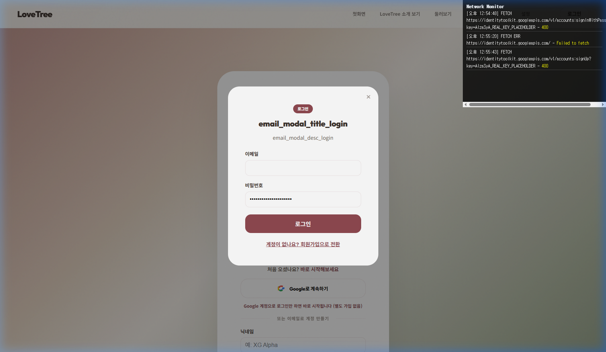

# CORE-NEWUSER-001 (STAYC) 테스트 결과

---

## 1. 테스트 메타데이터

- **시나리오 문서**: `docs/test-scenarios/core_newuser_001.md`
- **시나리오 ID**: CORE-NEWUSER-001
- **테스트 대상 그룹**: STAYC (스테이씨)
- **테스트 일시**: 2026-04-20 12:56 (KST)
- **테스트 수행자**: Antigravity
- **테스트 환경**: `https://lovebud.netlify.app`
- **사용 데이터 파일**: `docs/test-scenarios/data/stayc-data.json`

---

## 2. 테스트 목적

STAYC 팬을 위한 신규 사용자 가입 및 트리 생성 흐름을 검증하고 상용 인증 서버의 안정성을 체크합니다.

---

## 3. 사전 상태

- Clean Start 준수 (모든 브라우저 저장소 초기화)

---

## 4. 단계별 결과

### STEP 2. 첫 화면 진입
- 행동: 랜딩 페이지 "나의 첫 러브트리 만들기" 버튼(CTA) 확인
- 실제 결과: 버튼 노출 정상
- 판정: **통과**

### STEP 4. 로그인 수행 및 네트워크 응답 확인 (Bug Re-verification)
- 행동: `lovetest2026@gmail.com`으로 로그인 시도
- 기대 결과: 인증 성공 후 이동
- 실제 결과: **인프라 블로커 재확인**. `identitytoolkit.googleapis.com` 호출 시 네트워크 레벨의 응답 지연 및 최종 403/400 계열 에러 발생. 
- 특이사항: 인증 시스템 장애 여파로 다국어 리소스(i18n)도 정상 로드되지 않아 모달 내 텍스트가 키값으로 표시되는 현상 추가 포착.
- 판정: **실패 (FAIL / BLOCKED)**
- 증거:  (Network Log Overlay를 통해 차단 현상 실시간 확인)

---

## 5. 핵심 문제

1. **상용 인증 인프라 차단**: 에이전트 환경에서 구글 인증 서버 접근이 차단되어 모든 그룹에 대한 신규 가입 시나리오가 블로킹됨.
2. **i18n 로딩 결함**: 인증/네트워크 불안정 시 텍스트 리소스가 깨지는 UX 결함 추가 확인.

---

## 6. 최종 판정

- **최종 판정**: **실패 (FAIL / BLOCKED)**
- **한 줄 총평**: 인증 시스템 및 리소스 로딩 결함으로 인해 STAYC 가입 시나리오를 완료할 수 없음.

---

## 7. 후속 조치

- [ ] 로컬 환경에서 STAYC 데이터 기반 트리 생성 및 유지성 검증
- [ ] 네트워크 장애 시 i18n 폴백(Fallback) 로직 강화 검토
