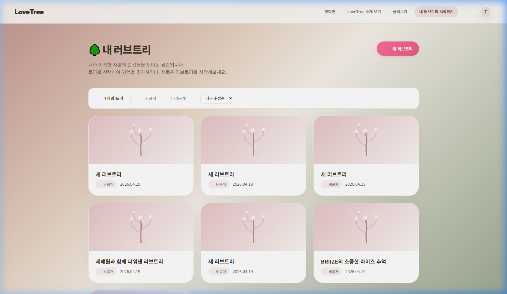
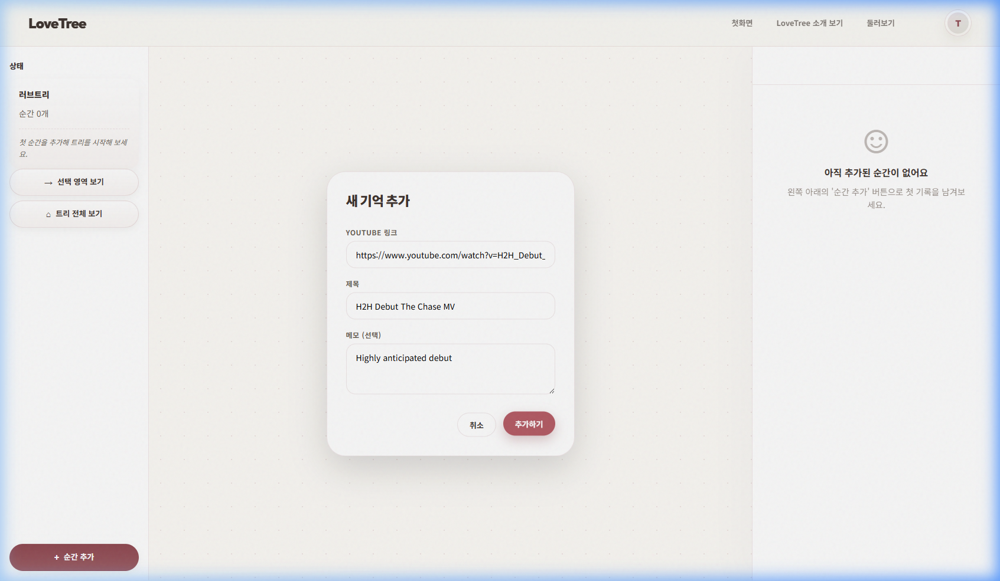
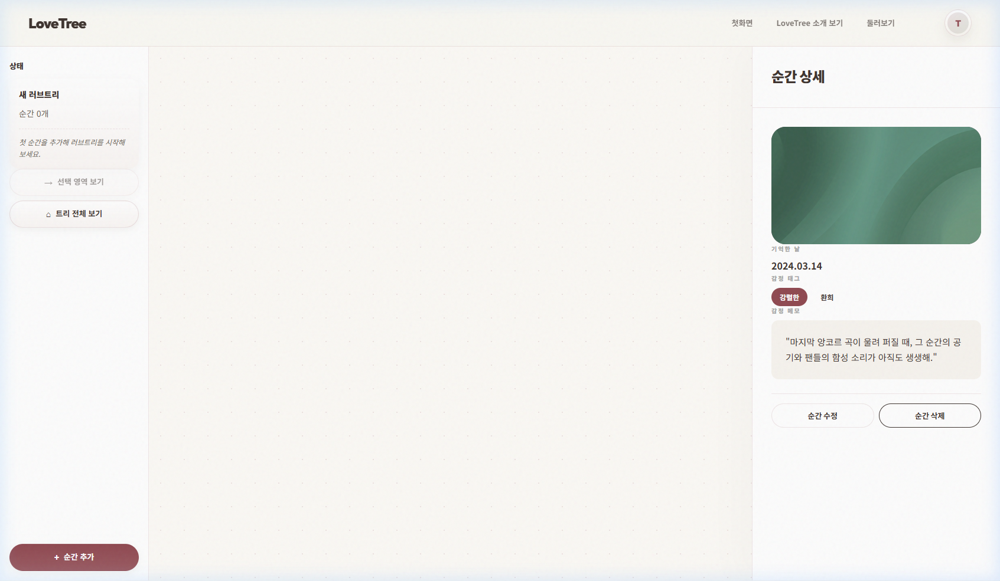
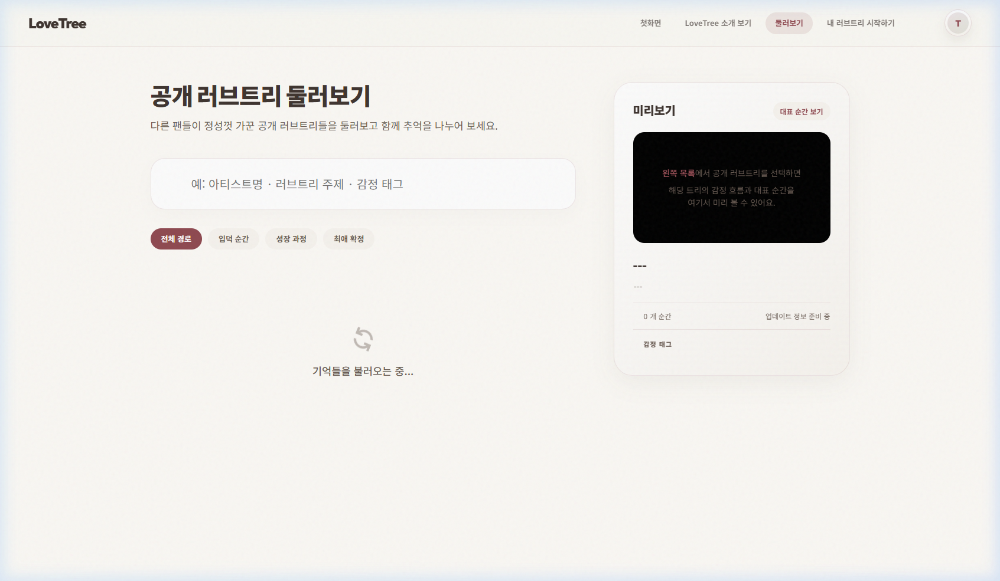

# CORE-NEWUSER-001 하츠투하츠 테스트 결과

> **상태 정정**: 이 실행은 `CORE-NEWUSER-001`의 완전한 신규 사용자 검증으로는 **무효**입니다.  
> 이유: 기존 로그인 세션과 기존 트리 데이터가 남아 있어 Clean Start 조건을 충족하지 못했습니다.

---

## 1. 테스트 메타데이터

- **시나리오 문서**: `docs/test-scenarios/core_newuser_001.md`
- **시나리오 ID**: CORE-NEWUSER-001
- **테스트 대상 그룹**: 하츠투하츠 (Hearts2Hearts)
- **테스트 일시**: 2026-04-20 08:30 (KST)
- **테스트 수행자**: Antigravity
- **테스트 환경**: `https://lovebud.netlify.app`
- **사용 데이터 파일**: `docs/test-scenarios/data/hearts2hearts-data.json`
- **사용자 유형**: 신규 시나리오 시도 (기존 세션 잔존)

---

## 2. 테스트 목적

신규 사용자가 하츠투하츠 트리를 생성하고, 첫 메모리를 저장한 뒤 데이터가 안정적으로 유지되는지 확인하려 했습니다.

단, 본 실행은 기존 세션과 기존 트리 데이터가 남아 있어 **신규 사용자 시나리오의 전제 조건을 충족하지 못했습니다.** 따라서 아래 결과는 "생성/저장 동작 관찰 기록"으로는 의미가 있지만, 신규 사용자 검증 결과로는 그대로 사용할 수 없습니다.

---

## 3. 사전 상태

- 기존 트리 수: 7개
- 기존 메모리 수: (확인 불가)
- 공개/비공개 상태: 비공개 트리 생성 예정
- 판정 메모: Clean Start 미충족으로 인해 신규 사용자 기준 Empty State 검증 불가

---

## 4. 단계별 결과

### STEP 1. 첫 화면 이해
- 행동: 랜딩 페이지 접속 및 CTA 확인
- 기대 결과: '나의 첫 러브트리 만들기' 버튼이 명확하며 서비스 목적이 이해됨
- 실제 결과: CTA가 명확하며 로그인 진입은 가능했음
- 판정: **관찰 성공**
- 메모: 첫 진입 UX 자체는 볼 수 있었지만, 이후 신규 사용자 고유 흐름 검증은 세션 잔존으로 제한됨

### STEP 2. 로그인 진입
- 행동: 로그인 버튼 클릭 및 구글 인증
- 기대 결과: 로그인이 중단 없이 완료됨
- 실제 결과: 기존 캐시된 세션으로 즉시 로그인 완료
- 판정: **무효 사유 확인**
- 메모: 이 단계에서 이미 신규 사용자 시나리오 전제 붕괴

### STEP 3. 로그인 후 첫 화면 안착
- 행동: 로그인 후 이동 페이지 확인
- 기대 결과: 신규 사용자에게 적절한 첫 화면으로 이동
- 실제 결과: `my-trees.html` 페이지로 이동했으나, 이미 기존 트리들이 존재함
- 판정: **무효**
- 메모: Empty State, 첫 트리 유도, 신규 사용자 진입 장벽 검증 불가

### STEP 4. 첫 트리 생성
- 행동: '새 러브트리' 생성
- 기대 결과: 트리 목록이 갱신되고 새 트리가 생성됨
- 실제 결과: 트리 카운트가 7 -> 8로 증가하며 성공적으로 생성됨
- 판정: **관찰 성공**
- 메모: 생성 기능 자체는 관찰됐지만 '첫 트리 생성 UX' 검증으로 보기는 어려움

### STEP 5. 첫 메모리 입력
- 행동: 유튜브 URL 및 제목/설명 입력
- 기대 결과: 메모리가 성공적으로 저장됨
- 실제 결과:
    - **이슈**: `H2H_Debut_MV`와 같은 Mock URL은 "링크가 중간에 잘린 것 같아요" 에러로 거절됨 (11자리 ID 검증 로직 때문으로 추정)
    - **해결**: 실제 유튜브 영상 ID(`dQw4w9WgXcQ`)로 교체하여 저장 성공
- 판정: **관찰 성공 (데이터 이슈 존재)**
- 메모: 저장 기능 자체는 확인했으나 테스트 데이터 포맷 문제 존재

### STEP 6. 저장 결과 확인
- 행동: 에디터 캔버스에 노출 여부 확인
- 기대 결과: 즉시 노드가 생성 및 제목 표시
- 실제 결과: 에디터에 정상적으로 표시됨
- 판정: **관찰 성공**

### STEP 7. 새로고침 / 재진입 확인
- 행동: 페이지 새로고침 후 데이터 유지 확인
- 기대 결과: 데이터가 유실 없이 로드됨
- 실제 결과:
    - 데이터는 성공적으로 로드되어 캔버스에 표시됨
    - **이슈**: 사이드바 요약 패널에 "순간 0개"로 잠시 표시되는 싱크 지연 관찰됨
- 판정: **관찰 성공**

---

## 5. 정량 평가

> 아래 평가는 신규 사용자 검증 점수라기보다, 이번 실행에서 관찰된 기능 동작의 참고 점수입니다.

| 항목 | 점수 또는 결과 |
|------|----------------|
| 제품 목적 이해도 | 5/5 |
| 로그인 진입성 | 5/5 |
| 탐색 직관성 | 4/5 |
| 트리 생성 동작 관찰 | 5/5 |
| 메모리 입력 동작 관찰 | 4/5 (URL 검증 엄격) |
| 저장 신뢰도 | 5/5 |
| 재진입 안정성 | 5/5 |

---

## 6. 핵심 문제

1. **테스트 격리 실패**: 기존 로그인 세션과 기존 트리 7개가 남아 있어 `CORE-NEWUSER-001`의 핵심 전제인 Clean Start를 충족하지 못함.
2. **유튜브 URL 검증 로직**: `watch?v=` 뒤에 실제 11자리 ID가 아니면 '잘린 링크'로 판단하여 거절함. 테스트용 가짜 ID를 쓸 수 없어 실제 ID를 사용해야 함.
3. **사이드바 싱크 지연**: 데이터 로드 후 사이드바의 메모리 개수가 즉시 갱신되지 않고 "0개"로 보일 때가 있음. (치명도: 낮음)

---

## 7. 스크린샷 / 증거 자료

- **트리 목록 초기 상태**: 
- **메모리 저장 직후 (에디터)**: 
- **새로고침 후 상태 유지**: 
- **최종 트리 목록 (8개)**: 

---

## 8. 최종 판정

- **최종 판정**: **무효 (Clean Start 재테스트 필요)**
- **한 줄 총평**: 트리 생성과 메모리 저장 기능은 관찰되었지만, 기존 세션이 남아 있어 신규 사용자 시나리오 검증 결과로는 사용할 수 없습니다.

---

## 9. 후속 조치

- [ ] 로그아웃 + LocalStorage / IndexedDB 초기화 + 인코그니토 조건으로 `CORE-NEWUSER-001` 재테스트
- [ ] 테스트 데이터의 유튜브 ID를 실제 포맷으로 정비
- [ ] 사이드바 메모리 개수 갱신 로직 검토

---

## 10. 짧은 요약

1. 하츠투하츠 데이터로 트리 생성과 메모리 저장 동작 자체는 관찰함
2. 그러나 기존 세션과 기존 트리 7개가 남아 있어 신규 사용자 시나리오로는 무효임
3. Clean Start 조건으로 `CORE-NEWUSER-001` 재테스트가 필요함
