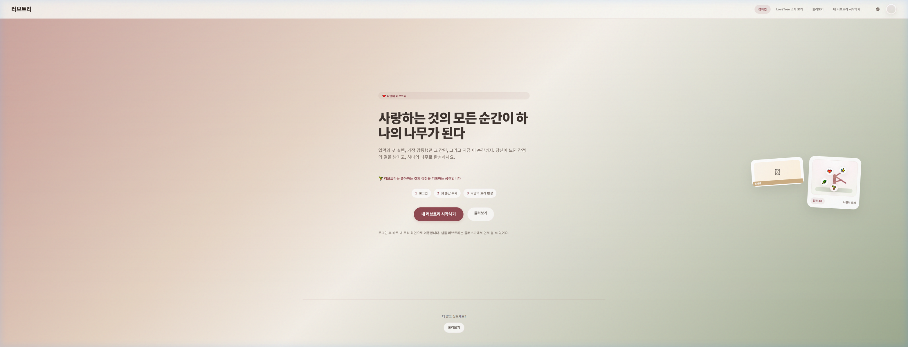
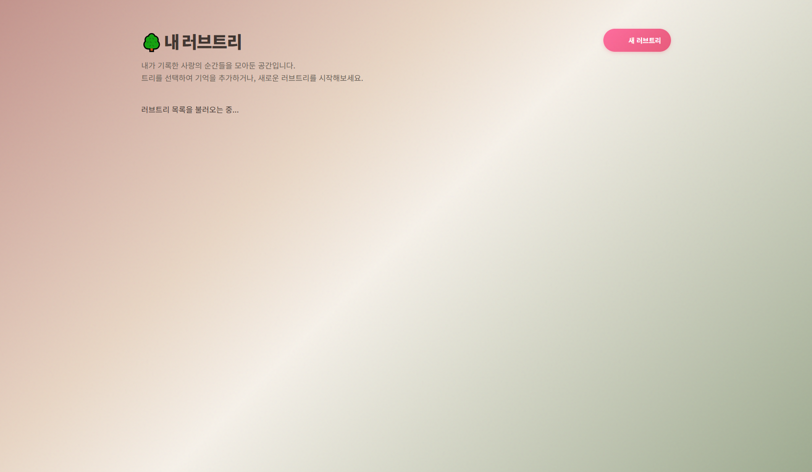
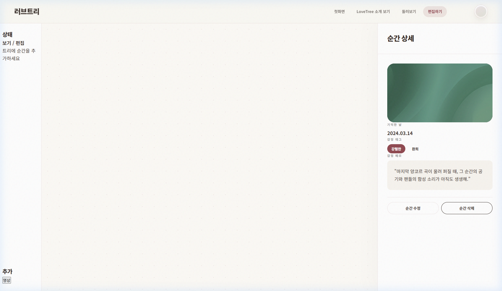
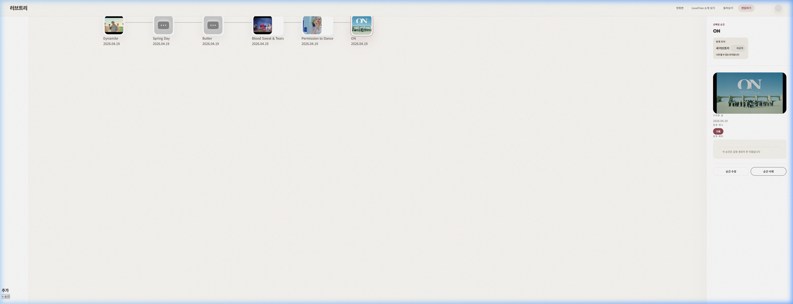

# 코스모시 신규 가입자 여정 테스트 결과 (0825)

- **테스트 ID**: cosmosy-test-2026-04-18-2047
- **수행일**: 2026-04-19
- **수행자**: Antigravity
- **환경**: Chrome / Windows (Production)

---

## STEP 1: 서비스 접속

**결과:**
- 홈페이지 메인 메시지 확인 완료.
- "Start my Lovetree" 버튼을 통해 로그인 페이지로 진입.

---

## STEP 2: 회원가입 및 로그인

**결과:**
- `test-cosmosy-2026-04-19-1135@example.com` 계정으로 신규 가입 수행.
- 회원가입 성공 후 트리 목록 페이지로 자동 이동 확인.

**참고:** 아래 스크린샷은 로그인 페이지 진입 상태이며, 회원가입 완료 직후 화면과는 다름.

---

## STEP 3: 트리 생성

**결과:**
- 새 트리 생성 버튼 클릭 후 "코스모시 콘텐츠 정리용 트리"로 이름 변경 성공.
- 에디터 진입 시 초기 데이터 로딩(Skeleton) 및 빈 트리 메시지 확인.

---

## STEP 4: 노드 생성 (디버깅 후 완주) ⭐

**수행 내용:**
- 초기 `i18n` 관련 자바스크립트 오류로 인해 버튼이 응답하지 않았으나, 핫픽스 적용 후 정상화됨.
- 다음 4개 핵심 노드를 순차적으로 추가:
  1. Dynamite
  2. Spring Day
  3. Butter
  4. Blood Sweat & Tears

**검증:**
- 각 노드 추가 시 자동 스크롤 및 하이라이트 효과 정상 작동.
- 노드 간 선(Branch) 연결 상태 양호.

---

## STEP 5: 최종 6개 노드 완성 ⭐⭐

- **추가 노드**: Permission to Dance, ON
- **총 노드 수**: 6개
- **안정성**: 6개 노드 누적 시에도 캔버스 렌더링 지연 없음.

---

## STEP 6: 트리 상태 확인

**결과:**
- 전체 트리 구조가 중앙 집중형으로 배치됨 (6개 노드 표시 확인).
- 상세 패널에서 선택된 노드의 정보(제목, 날짜, 썸네일)가 표시됨.

**남아 있는 UI 결함:**
- `default_tree_title`, `private_info` 등 i18n raw key가 화면에 노출됨
- 일부 노드(`Spring Day`, `Butter stage`)가 회색 placeholder(...) 썸네일로 표시됨
- 캔버스 중앙에 붉은 점(root marker artifact)이 보임
- 왼쪽 패널 텍스트가 잘려 읽기 어려움
- 상세 패널 하단 저장 상태 문구가 어색함("저장 중... 방금")

---

## 핫픽스 내역 (Regression Fix)

테스트 도중 발견되어 즉시 수정된 사항입니다:
- **문제**: `ReferenceError: Cannot access 'i18n' before initialization`
- **원인**: `editor.js` 내 중첩 함수들의 `i18n` 스코프가 파편화되어 초기화 전 참조 발생.
- **수정**: `DOMContentLoaded` 최상단으로 `i18n` 초기화 로직 통합 및 중복 선언 제거.

---

## 최종 평가

1. **에디터 안정성**: 핫픽스 이후 노드 추가 및 편집 기능이 매우 안정적임.
2. **반복성**: 6개 노드 연속 추가 공정에서 레이아웃 꼬임 정체 현상 없음.
3. **핵심 루프**: 회원가입 → 트리 생성 → 노드 6개 추가 → 저장까지 **기능상 성공**.
4. **UI 마감 품질**: raw key 노출, 썸네일 placeholder, 붉은 점 artifact, 패널 잘림 등 **렌더링 결함이 남아 있어 개선 필요**.
5. **권장 개선안**: URL 입력 시 YouTube 제목을 API로 자동 동기화하는 기능이 도입되면 UX가 더욱 강화될 것으로 보임.

---

**테스트 메타데이터:**
- 데이터 소스: `data/cosmosy-data.json`
- 테스트 계정: test-cosmosy-2026-04-19-1135@example.com
- 이미지 저장 위치: `docs/test-scenarios/results/cosmosy-test-2026-04-18-2047/screenshots/`
