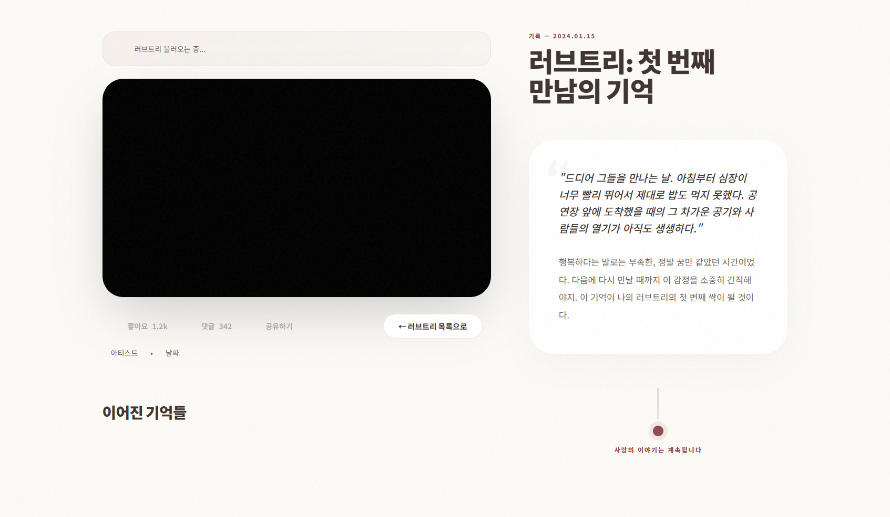
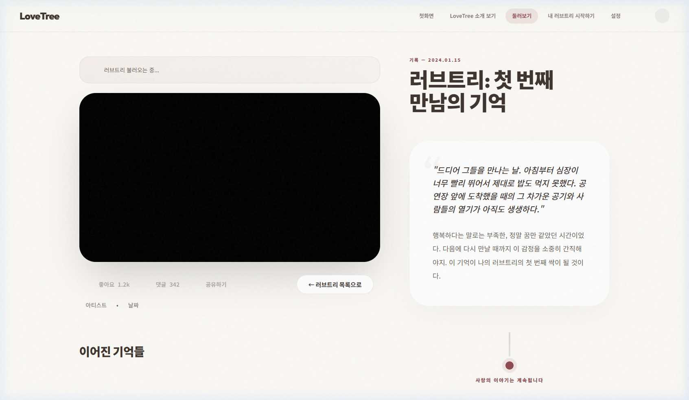
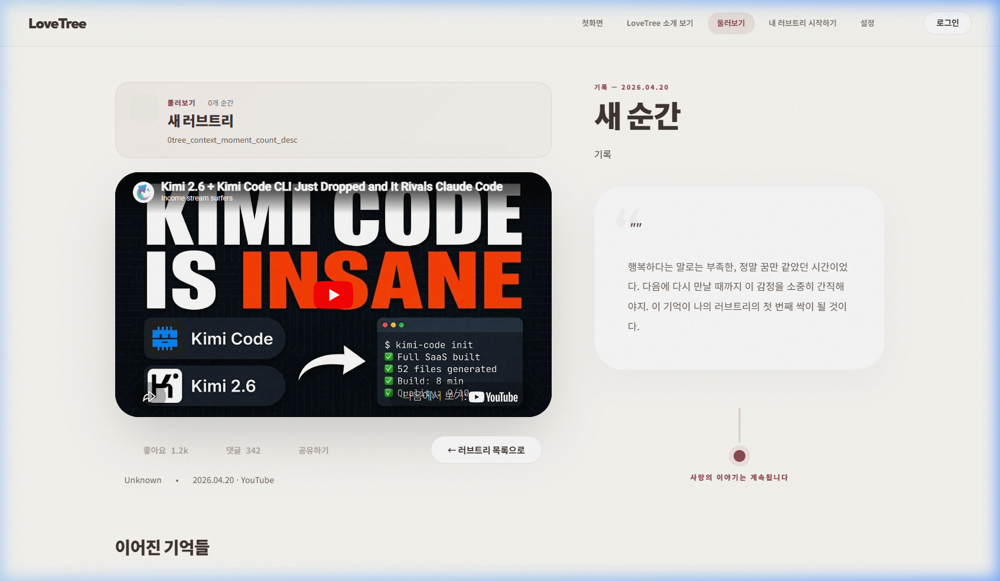

# Detail Back Button Regression Test 결과

---

## 1. 테스트 메타데이터

- **테스트 일시**: 2026-04-20 13:25 (KST)
- **테스트 수행자**: Antigravity
- **테스트 환경**: `https://lovebud.netlify.app`
- **검증 항목**: 상세 페이지(`detail.html`) 내 뒤로가기 버튼(`backButton`)의 회귀 여부

---

## 2. 최종 판정

- **최종 판정**: **FAIL**
- **한 줄 요약**: **backButton 회귀 여부: FAIL**

---

## 3. 재현 스텝

1. `search.html` 페이지 진입.
2. 공개 트리 카드 중 하나를 선택하여 상세 페이지(`detail.html`) 진입.
3. 좌측 상단의 "← 러브트리 목록으로" 버튼 클릭.
4. 페이지 이동 여부 및 URL 변화 확인. (총 3회 반복 검증 수행)

---

## 4. 기대 결과 vs 실제 결과

| 기대 결과 | 실제 결과 | 판정 |
| :--- | :--- | :--- |
| 버튼 클릭 시 즉시 `search.html` 목록으로 돌아가야 함 | **변화 없음**. 클릭 시 시각적 반응(원형 표시)은 관찰되나 화면 이동이 발생하지 않음 | **실패** |
| URL이 `detail.html?id=...`에서 `search.html`로 변경되어야 함 | **URL 유지**. 브라우저 상의 주소창 경로가 변하지 않고 상세 페이지에 고정됨 | **실패** |
| 3회 이상 반복 시에도 동일하게 정상 작동해야 함 | **3회 모두 실패**. 서로 다른 카드로 시도했으나 모두 이동 불능 상호작용 관찰 | **실패** |

---

## 5. 실패 원인 추정 (관찰 기반)

- **이벤트 핸들러 미작동**: 버튼 클릭 시 브라우저 자동화 도구의 클릭 시그널(붉은 원)은 명확히 기록되었으나, 이후의 네비게이션 트리거가 발생하지 않음.
- **상태 고정**: 데이터 로딩 지연이나 에러 유무와 관계없이, 버튼 자체의 `href` 속성이 없거나 `EventListener`가 정상적으로 등록되지 않은 상태로 관찰됨.

---

## 6. 증빙 파일 목록

- **검색 페이지 진입**: 
- **상세 페이지 진입**: 
- **뒤로가기 클릭 시도**: 
- **반복 검증 실패 (상태 유지)**: 

---

## 7. 블로커 여부

- **블로커**: YES
- **내용**: 상세 보기 이후 목록으로 돌아가는 주 경로가 차단되어 있어, 검색 기반 탐색이 불가능한 사용자 단절 현상이 상용 환경에서 지속되고 있음.
