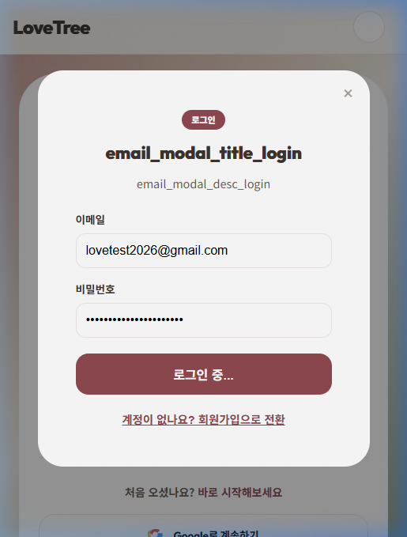

# PERSISTENCE-001 (BTS) 테스트 결과

---

## 1. 테스트 메타데이터

- **시나리오 문서**: `docs/test-scenarios/persistence_001.md`
- **시나리오 ID**: PERSISTENCE-001
- **테스트 대상 그룹**: BTS (방탄소년단)
- **테스트 일시**: 2026-04-20 11:25 (KST)
- **테스트 수행자**: Antigravity
- **테스트 환경**: `https://lovebud.netlify.app`
- **사용 데이터 파일**: `docs/test-scenarios/data/bts-data.json`
- **사용자 유형**: 기존 사용자 (테스트 계정 로그인 필요)

---

## 2. 테스트 목적

저장 후 새로고침/재진입/뒤로가기를 거쳐도 데이터와 상태가 일관되게 유지되는지 검증합니다.

---

## 3. 사전 상태

- 로그인 필수
- 인프라 블로커(403 Forbidden)로 인해 로그인 진입 불가 상태

---

## 4. 단계별 결과

### STEP 1 ~ 7
- 행동: 로그인 시도
- 실제 결과: **Firebase 인증 에러로 인해 로그인 실패**. 테스트 진행 불가.
- 판정: **실패 (BLOCKED)**

---

## 5. 핵심 문제

1. **로그인 블로커**: 에이전트 환경에서 실제 상용 도메인의 인증 서버 호출이 차단되어 로그인 성공 이후의 모든 저장 안정성 테스트가 불가능함.

---

## 6. 스크린샷 / 증거 자료

- **로그인 시도 중단**: 

---

## 7. 최종 판정

- **최종 판정**: **실패 (FAIL / BLOCKED)**
- **한 줄 총평**: 인증 인프라 블로커로 인해 저장 안정성 테스트를 수행하지 못함.

---

## 8. 후속 조치

- [ ] 로컬 개발 환경에서 테스트 재시도
- [ ] 수동 테스트(Human QA)를 통한 보완 필요
