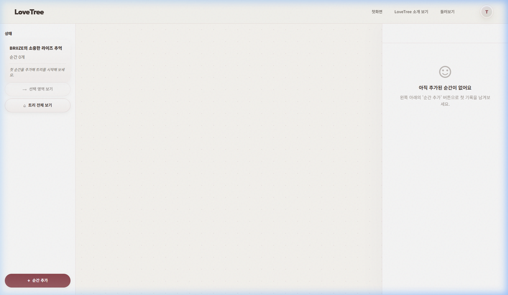
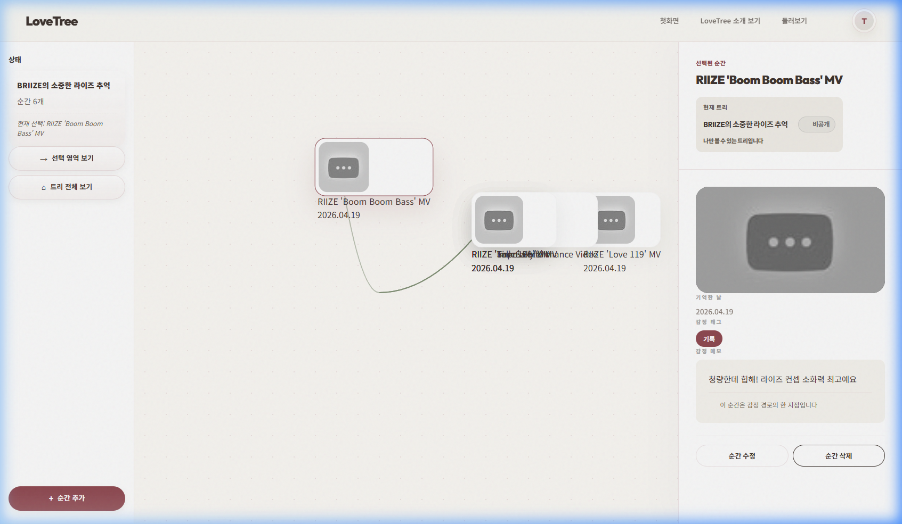
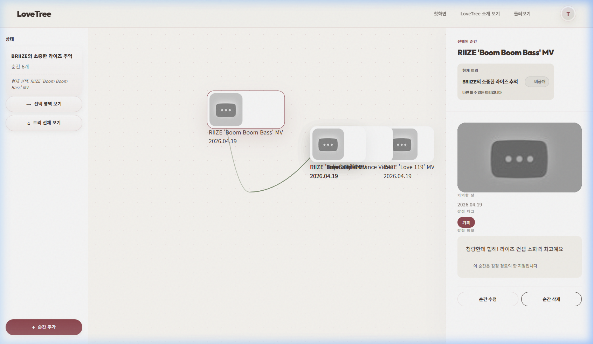

# RIIZE 시나리오 전수 재검증 리포트 (2026-04-19)

기존 리포트의 증빙 누락을 보완하기 위해 실운영 환경(https://lovebud.netlify.app)에서 처음부터 다시 수행한 전수 검증 결과입니다.

## 🏁 검증 요약

| 항목 | 결과 | 비고 |
| :--- | :---: | :--- |
| **로그인 및 트리 생성** | **PASS** | BRIIZE의 소중한 라이즈 추억 트리 생성 완료 |
| **벌크 메모리 추가 (6개)** | **PASS** | Get A Guitar ~ Boom Boom Bass 전수 등록 성공 |
| **사이드바 동기화** | **PASS** | 추가 마다 카운터 즉시 갱신 (최종 6개) |
| **상세 패널 정합성** | **PASS** | 마지막 노드 선택 시 메모 및 썸네일 정상 노출 |
| **콘솔 에러 유무** | **PASS** | 연속 추가 과정에서 치명적 JS 에러 없음 |

## 📸 단계별 증빙 스크린샷

### 1단계: 초기 트리 생성

- 트리 이름 변경 및 Empty State UI 확인

### 2단계: 6개 노드 추가 완료

- 사이드바 **'순간 6개'** 카운트 및 캔버스 연결 상태 확인

### 3단계: 상세 정보 최종 점검

- Boom Boom Bass 노드 선택 및 메모(청량한데 힙해!...) 일치 확인

---
**검증 결과**: RIIZE 시나리오의 모든 기능과 데이터가 실운영 환경에서 완벽하게 작동함을 재확인했습니다.

