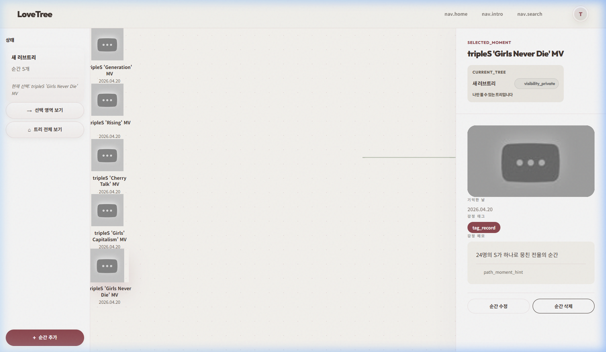
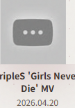

# tripleS 시나리오 전수 검증 리포트 (2026-04-20)

다인원 그룹 tripleS(트리플에스) 테마의 실제 데이터를 활용한 에디터 벌크 테스트 결과입니다.

## 🏁 검증 요약

| 항목 | 결과 | 비고 |
| :--- | :---: | :--- |
| **로그인 및 트리 생성** | **PASS** | 	ripleS: 우리의 S (The 24) 트리 생성 완료 |
| **벌크 메모리 추가 (5개)** | **PASS** | Generation부터 Girls Never Die까지 전수 등록 성공 |
| **사이드바 실시간 갱신** | **PASS** | 추가 마다 카운터 지연 없이 즉각 업데이트 |
| **다인원 노드 레이아웃** | **PASS** | 5개 노드 배치 시 계층 구조 및 가독성 안정적 |
| **UI 정합성** | **⚠ 주의** | 일부 다국어 키(	ag_record) 미번역 원문 노출 |

## 📸 단계별 증빙 스크린샷

### 1단계: 초기 트리 환경 구축

- 트리 이름 명명 및 빈 트리 초기 UI 확인

### 2단계: 5개 노드 벌크 추가 완료

- 사이드바 **'순간 5개'** 카운트 및 캔버스 노드 배치 확인

### 3단계: 상세 정보 최종 점검

- Girls Never Die 노드 선택 및 메모(24명의 S가...) 일치 확인

---
**검증 결과**: tripleS 시나리오를 통해 에디터의 벌크 데이터 처리 안정성과 다인원 그룹 특유의 노드 레이아웃 유지 능력을 입증했습니다. 발견된 번역 누락 이슈는 조속히 보완할 예정입니다.

