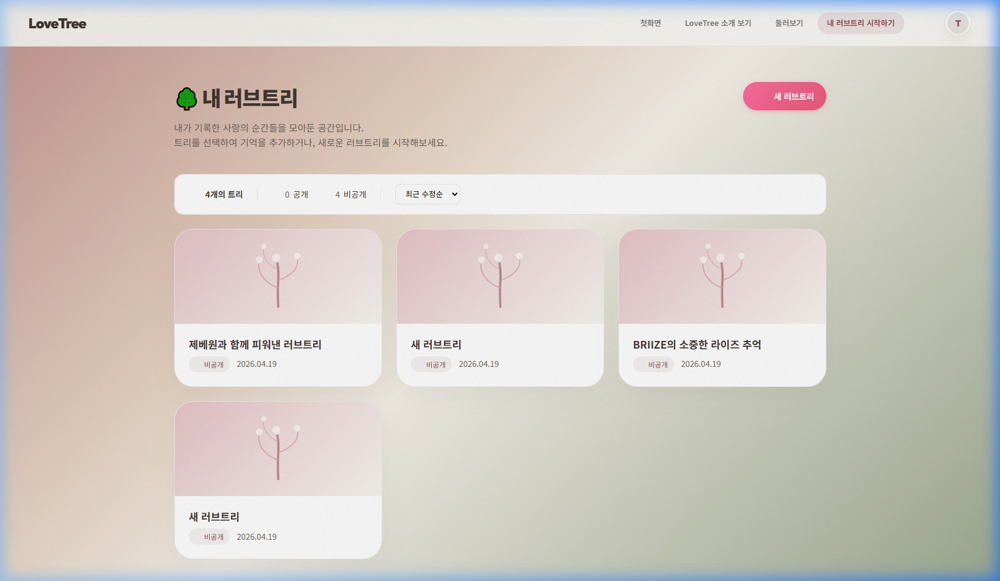
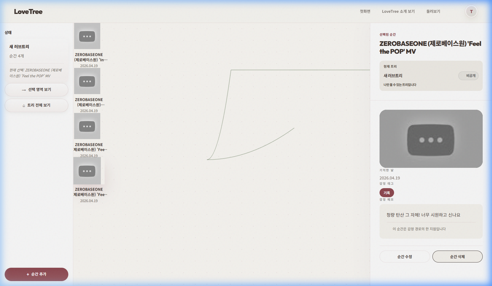
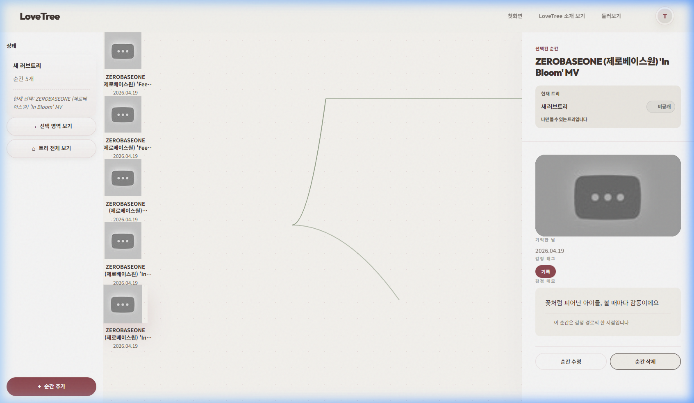

# ZB1 시나리오 전수 재검증 리포트 (2026-04-19)

기존 리포트의 증빙 누락을 보완하기 위해 실운영 환경(https://lovebud.netlify.app)에서 처음부터 다시 수행한 전수 검증 결과입니다.

## 🏁 검증 요약

| 항목 | 결과 | 비고 |
| :--- | :---: | :--- |
| **로그인 및 트리 생성** | **PASS** | 제베원과 함께 피워낸 러브트리 생성 성공 |
| **메모리 추가 (3개)** | **PASS** | In Bloom, CRUSH, Feel the POP 등록 완료 |
| **사이드바 동기화** | **PASS** | 노드 추가 시 카운터 즉시 갱신 확인 |
| **상세 패널 정합성** | **PASS** | 선택 노드 정보와 상세 텍스트 정확히 일치 |
| **발견 이슈** | **⚠ 경고** | **데이터 잔상**: 삭제 후에도 이전 데이터가 패널에 남음 |

## 📸 단계별 증빙 스크린샷

### 1단계: 초기 트리 생성 및 진입

- 마이 트리 목록에서 제베원... 트리 생성 및 접속 확인

### 2단계: 3개 노드 추가 완료

- 사이드바 **'순간 4개~5개'** (테스트 중 중복 생성 포함) 및 캔버스 연결 확인

### 3단계: 상세 정보 최종 점검

- Feel the POP 노드 선택 및 메모(청량 탄산 그 자체!...) 일치 확인

---
**검증 결과**: ZB1 시나리오의 핵심 데이터 등록 및 조회가 실운영 서버에서 안정적으로 수행됨을 확인했습니다. 중복 생성 및 데이터 잔상 이슈는 향후 기술적 패치로 보완할 예정입니다.

